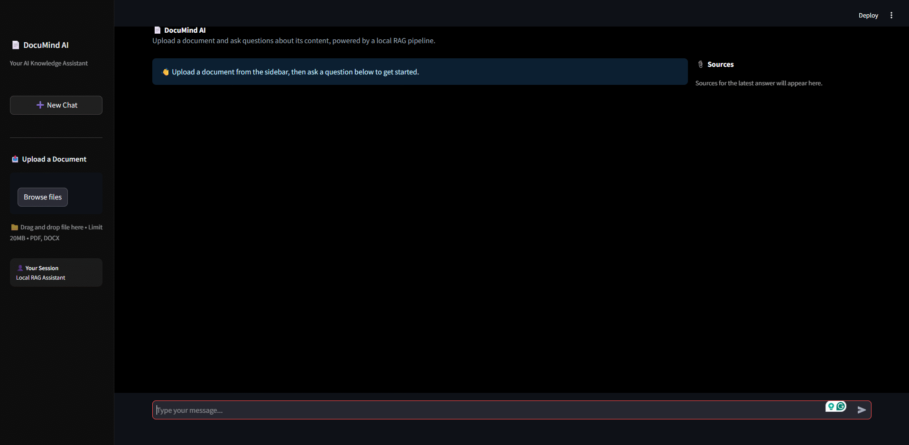

# DocuMind AI 📄

I built this project to understand how RAG (Retrieval-Augmented Generation) systems actually work under the hood — not just calling an API, but building every piece myself: parsing documents, chunking text, generating embeddings, storing them in a vector database, and connecting everything to a local LLM.

The result is a small app where you can upload a PDF or DOCX file and ask questions about it. Instead of the AI guessing or making things up, it looks up the relevant part of your document first, then answers based on that — with a source citation attached.

Everything runs locally. No API keys, no cloud costs, no data leaving your machine.

## What it does

- Upload a PDF or DOCX and it gets processed automatically
- Ask questions in plain English through a chat interface
- Answers are grounded in your actual document content, with the source file shown
- Search is semantic, not keyword-based — it understands meaning, not just matching words

## How it's built

| Part | Tool |
|---|---|
| API backend | FastAPI |
| UI | Streamlit |
| Vector storage | ChromaDB |
| Embeddings | Sentence Transformers (`all-MiniLM-L6-v2`) |
| LLM | Ollama, running `llama3.2:1b` locally |
| Document parsing | PyPDF, python-docx |
| Tests | pytest |

## The flow

A document goes through this pipeline before you can ask anything about it:

```
Upload → Extract text → Split into overlapping chunks →
Generate embeddings → Store in ChromaDB
```

Then when you ask a question:

```
Question → Search ChromaDB for the most relevant chunks →
Build a prompt with that context → Ollama generates the answer
```

## Running it yourself

You'll need Python 3.11+ and [Ollama](https://ollama.com) installed.

```bash
git clone https://github.com/hasan-murad1/docu-mind-ai.git
cd docu-mind-ai

python -m venv venv
venv\Scripts\activate

pip install -r requirements.txt
ollama pull llama3.2:1b
```

Then run the backend and frontend in two separate terminals:

```bash
# Terminal 1
uvicorn app.main:app --reload

# Terminal 2
streamlit run frontend/app.py
```

Open `http://localhost:8501` and start uploading documents.

To run the tests:
```bash
pytest tests/ -v
```

## Project layout

```
docu-mind-ai/
├── app/
│   ├── core/
│   │   ├── document_processor.py   # extracts and chunks text
│   │   ├── vector_store.py         # embeddings + ChromaDB
│   │   └── rag_pipeline.py         # ties retrieval + LLM together
│   └── main.py                     # FastAPI app
├── frontend/
│   └── app.py                      # Streamlit UI
├── tests/
│   ├── test_document_processor.py
│   └── test_vector_store.py
└── requirements.txt
```

## A few things I ran into while building this

The first version gave noticeably worse answers than I expected — the LLM would sometimes say it didn't have enough information, even when the answer was clearly in the retrieved text. Turned out the chunks were too large (300 words), so the specific fact I needed was buried inside a lot of surrounding text that a small model struggled to parse through. Shrinking the chunk size to 100 words and tightening the prompt instructions fixed it.

I also had to lower the LLM's temperature to reduce hallucination — by default it would occasionally answer confidently with something not in the document at all.

On the security side, file uploads are restricted to PDF/DOCX, capped at 20MB, and saved under a randomly generated filename rather than the user-supplied one, to avoid path traversal issues.

### Known limitations

While testing with a longer, denser document (a fictional company knowledge base with pricing tables and an FAQ section), I found two patterns where answers weren't reliable:

The first is anything requiring the model to compare numbers. For example, asking "my order is 20,000 — can I pay cash on delivery?" sometimes fails even though the document clearly states the COD limit is 15,000. I dug into this by checking retrieval separately from generation, and confirmed the correct sentence was actually being pulled from the vector store every time — the model just couldn't reliably do the "is 20,000 greater than 15,000" comparison on its own. That's a limitation of using a 1B-parameter model, not a bug in the retrieval logic.

The second is dense FAQ-style sections. When a document has many short Q&A pairs back to back, my word-count-based chunking sometimes lumps several unrelated questions into one chunk, which can dilute the specific answer enough that it doesn't get retrieved even at `top_k=7`. A better approach for FAQ content would be to chunk by individual Q&A pairs instead of a fixed word count — something I'd tackle if I extended this project.

I chose not to fix these by switching to a bigger model, mainly to keep the project fast and lightweight to run locally. Worth knowing about if you're testing this yourself.

## Note

Built as a learning project to understand RAG systems end-to-end. Not production-hardened, but the core pipeline works correctly and is covered by tests.